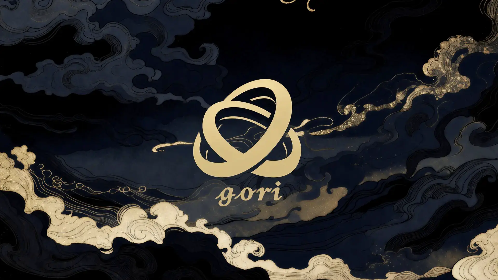
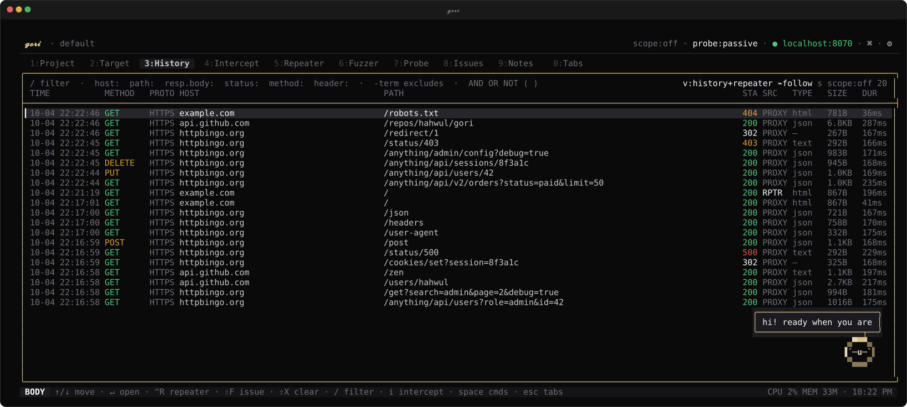

<div align="center">
  <br>
  
  <p>Hack from the terminal.</p>
</div>
<p align="center">
<a href="https://github.com/hahwul/gori/blob/main/.github/CONTRIBUTING.md">
</a>
<a href="https://github.com/hahwul/gori/releases">
</a>
<a href="https://crystal-lang.org">
</a>
</p>

<p align="center">
  <a href="#installation">Installation</a> •
  <a href="#usage">Usage</a> •
  <a href="docs/">Documentation</a> •
  <a href=".github/CONTRIBUTING.md">Contributing</a>
</p>

---

**gori** (고리 — Korean for *ring, link, loop*) sits in the loop between your client and its target,
capturing every request and response as a *flow* you can replay, fuzz, and scan across HTTP/1.1,
HTTP/2, WebSocket, gRPC, and SSE, and intercept in flight on HTTP/1.1 and HTTP/2. Core assessment
actions that cross surfaces use the same engines, and those workflows are also
available through `gori run` and MCP, so scripts and AI agents can drive the same engagement.
The [capability matrix](https://gori.hahwul.com/reference/capabilities/) names the protocol and
surface limits explicitly.



<details>
<summary><strong>Features</strong></summary>

### Capture & Intercept
- Capturing proxy for HTTP/1.1, HTTP/2, WebSocket, gRPC, and SSE
- Intercept on HTTP/1.1 and HTTP/2, gRPC included: hold, edit, forward, or drop in flight — and per-message on an HTTP/1.1 WebSocket, opt in with `proto:ws`
- Searchable History of every flow, with a query language for filtering
- Scope rules, hostname overrides, and match & replace

### Replay, Fuzz & Decode
- Repeater workbench for crafting and re-sending requests (incl. WebSocket & gRPC)
- Intruder-style Fuzzer with four attack modes
- Decoder pipeline for chained encode / decode / hash, including signed session cookies
- Side-by-side Comparer for diffing two flows
- Inline JWT / SAML / GraphQL / protobuf / MessagePack / CBOR decoding, hex view, and pretty-printing
- Copy any request as cURL, Python, `fetch`, Go, httpie, or a CSRF PoC

### Discover & Scan
- Prism passive & light-touch active vulnerability scanner
- Param Miner for hidden-parameter discovery
- Authorize matrix: replay one request under several identities to find broken access control
- Sequencer for grading the randomness of session, CSRF, and reset tokens
- Cookie workbench to verify, crack, and re-sign Flask / Rack / Django session cookies
- OAST collector for confirming blind SSRF, XXE, and injection out of band
- Findings triage with Markdown / JSON export

### Keyboard-first Workflow
- Command palette (`Ctrl-P`) and context space menu (`Space`) reach every action
- Rebindable hotkeys and switchable colour themes
- Mouse support, multi-line editing, and go-to-line navigation

### Headless & Scriptable
- `gori run` exposes the core project and testing workflows for non-interactive use
- MCP server (`gori mcp`) exposes those workflows to AI agents (it does not start a capture proxy)

</details>

## Installation

### Quick install (macOS / Linux)

```bash
curl -fsSL https://gori.hahwul.com/install.sh | bash
```

Then update later with `gori update` (self-update for binary installs; package-manager guidance for Homebrew / Snap / AUR).

### Homebrew

```bash
brew tap hahwul/gori
brew install gori
```

### Nix

The repo is a flake, so it runs without being installed:

```bash
nix run github:hahwul/gori
nix profile install github:hahwul/gori   # or keep it
```

### From source

Requires [Crystal](https://crystal-lang.org/) `>= 1.21.0` and `pkg-config`.

```bash
git clone https://github.com/hahwul/gori.git
cd gori
shards build --release
```

The binary is written to `bin/gori`.

> For system libraries (Brotli / Zstd), offline builds, and other options, see the
> [Installation guide](https://gori.hahwul.com/getting-started/installation/).

## Usage

gori runs one engine and one project behind three entry points. Drive it yourself, hand it to an
AI agent, or script it, and pick the one that fits who is at the controls.

### For humans: `gori` (TUI)

Start the proxy and open the interactive terminal UI. No subcommand needed:

```bash
gori
```

The proxy listens on `127.0.0.1:8070` by default, and a short first-run wizard picks the
**global default** bind and theme (projects can pin their own later). To intercept HTTPS, trust
gori's root CA. The quickest path is the palette's **Open browser** (`Ctrl-P`), which launches a
browser already trusted and proxied. Captured traffic lands in **History**; press `Ctrl-P` for the
command palette or `Space` for context actions.

```bash
gori --listen 0.0.0.0 --port 8080   # global bind for this run only (not persisted)
```

### For AI agents: `gori mcp` (MCP server)

`gori mcp` is a [Model Context Protocol](https://modelcontextprotocol.io) server. An AI client
spawns it over stdio, reads your traffic, and drives the same tools you do. Let gori write the
config for your agent, then restart the client:

```bash
gori mcp --install-claude-code   # Claude Code   (~/.claude.json)
gori mcp --install-claude        # Claude Desktop
gori mcp --install-codex         # OpenAI Codex
gori mcp --install-agy           # Antigravity CLI
gori mcp --install-grok          # Grok
gori mcp --install-hermes        # Hermes        (~/.hermes/config.yaml)
gori mcp --install-pi            # Pi            (~/.pi/agent/mcp.json)
```

Pi needs an MCP adapter, such as [pi-mcp-adapter](https://github.com/nicobailon/pi-mcp-adapter)
(`pi install npm:pi-mcp-adapter`). The installer honors `PI_CODING_AGENT_DIR` when set.

Add `--read-only` to hand a project to an untrusted agent (read tools only, no live requests). The
[AI Setup guide](https://gori.hahwul.com/getting-started/ai-setup/) walks through connecting an agent and
running your first request.

### For scripts: `gori run` (headless CLI)

`gori run` exposes the same core project and testing engines without the interactive UI. It is
built for scripting and CI, but works just as well by hand or from an agent's shell:

```bash
gori run history --format json      # dump captured flows as JSON
gori run sitemap                    # endpoints seen so far
gori run --help                     # every subcommand
```

All three entry points share the same project database. See the [documentation](https://gori.hahwul.com) for the
full guide, or open the **Help** tab in the app.

## Development

```bash
shards build          # release binary at bin/gori
shards run gori       # run without installing
```

If linking fails with undefined `BrotliDecoder*` symbols, `libbrotlidec` is missing or
`pkg-config` cannot find it — see the
[Installation guide](https://gori.hahwul.com/getting-started/installation/) for the system libraries and the
`-Dwithout_native_codecs` offline build.

## Contributors

[](https://github.com/hahwul/gori/graphs/contributors)

Contributions are welcome — see [CONTRIBUTING.md](.github/CONTRIBUTING.md) to get set up.
Not every kind of help lands as a commit, so the line under each name says what it was: the bug
reports and reproductions up there found things gori would not have found on its own. To credit
someone, edit [`.github/contributor-mural.yml`](.github/contributor-mural.yml).

## Why "gori"?

gori (고리) is the Korean word for a **ring, link, or loop** — exactly where the tool sits: in the
loop between your client and its target, capturing and reshaping each request as it passes through.
*Sit in the loop.*


## 🌐 Web Resources & Aesthetic Symbols Index
- [SYM 1D438](https://anime-sparkle-text-56.pages.dev/symbol/sym-1d438/)
- [SYM 1D446](https://subtle-text-studio-66.pages.dev/symbol/sym-1d446/)
- [SYM 26F2](https://academic-rune-text-25.pages.dev/symbol/sym-26f2/)
- [SYM 2611](https://gothic-bio-fonts-14.pages.dev/symbol/sym-2611/)
- [SYM 26C9](https://kawaii-kaomoji-hub-77.pages.dev/symbol/sym-26c9/)
- [INSTAGRAM BIO](https://sleek-type-aesthetic-51.pages.dev/pt/instagram-bio/)
- [SYM 2676](https://soft-angel-unicode-43.pages.dev/symbol/sym-2676/)
- [SYM 1F929](https://academic-rune-text-25.pages.dev/symbol/sym-1f929/)
- [SYM 1F494](https://subtle-sparkle-text-86.pages.dev/symbol/sym-1f494/)
- [ZODIAC CELESTIAL](https://sleek-bio-fonts-25.pages.dev/es/zodiac-celestial/)
- [STARS](https://clean-mono-fonts-64.pages.dev/es/stars/)
- [SYM 1F63B](https://angelic-bow-symbols-76.pages.dev/symbol/sym-1f63b/)
- [SYM 1F63F](https://anime-sparkle-text-81.pages.dev/symbol/sym-1f63f/)
- [SYM 1D484](https://matrix-terminal-fonts-30.pages.dev/symbol/sym-1d484/)
- [SKULL AND CROSSBONES](https://matrix-glitch-text-59.pages.dev/symbol/skull-and-crossbones/)
- [BORDERS DIVIDERS](https://cyber-clan-tags-20.pages.dev/borders-dividers/)
- [ROBLOX NAMES](https://soft-angel-unicode-43.pages.dev/ja/roblox-names/)
- [ARROWS LINES](https://cyber-clan-tags-36.pages.dev/pt/arrows-lines/)
- [SYM 1F927](https://sleek-arrow-symbols-42.pages.dev/symbol/sym-1f927/)
- [SYM 2627](https://sleek-unicode-art-69.pages.dev/symbol/sym-2627/)
- [SYM 2764 FE0F](https://ribbon-bow-unicode-18.pages.dev/symbol/sym-2764-fe0f/)
- [SYM 1F63B](https://cyber-clan-tags-38.pages.dev/symbol/sym-1f63b/)
- [SYM 26D4](https://vintage-lace-symbols-65.pages.dev/symbol/sym-26d4/)
- [BRACKETS](https://coquette-aesthetic-symbols-96.pages.dev/ru/brackets/)
- [SYM 2744](https://manga-emotion-symbols-69.pages.dev/symbol/sym-2744/)
- [GEORGIAN LOVE HEART](https://chibi-emoticon-lab-65.pages.dev/symbol/georgian-love-heart/)
- [GAMING WEAPONS](https://ribbon-bow-unicode-18.pages.dev/es/gaming-weapons/)
- [SYM 1F92A](https://soft-pastel-unicode-78.pages.dev/symbol/sym-1f92a/)
- [SYM 2683](https://zen-unicode-symbols-89.pages.dev/symbol/sym-2683/)
- [SYM 26B1](https://soft-pink-fonts-41.pages.dev/symbol/sym-26b1/)
- [SYM 2742](https://zen-unicode-hub-94.pages.dev/symbol/sym-2742/)
- [BORDERS DIVIDERS](https://minimal-star-symbols-43.pages.dev/ru/borders-dividers/)
- [BRACKETS](https://kawaii-kaomoji-hub-80.pages.dev/ru/brackets/)
- [SYM 26B9](https://cyber-clan-tags-55.pages.dev/symbol/sym-26b9/)
- [SYM 26BD](https://vintage-lace-symbols-65.pages.dev/symbol/sym-26bd/)
- [SYM 2667](https://ballet-core-symbols-11.pages.dev/symbol/sym-2667/)
- [FREE FIRE CLAN EMPEROR CROWN](https://balletcore-unicode-67.pages.dev/symbol/free-fire-clan-emperor-crown/)
- [RIGHT MATHEMATICAL WHITE SQUARE BRACKET](https://neon-matrix-symbols-74.pages.dev/symbol/right-mathematical-white-square-bracket/)
- [OPEN CENTRE STAR](https://ribbon-bow-unicode-18.pages.dev/symbol/open-centre-star/)
- [SYM 1F611](https://anime-sparkle-text-45.pages.dev/symbol/sym-1f611/)
- [SYM 2644](https://angelic-soft-text-59.pages.dev/symbol/sym-2644/)
- [SYM 26CB](https://zen-unicode-hub-94.pages.dev/symbol/sym-26cb/)
- [SYM 1F973](https://angelic-bow-symbols-76.pages.dev/symbol/sym-1f973/)
- [SYM 26C9](https://vintage-lace-symbols-65.pages.dev/symbol/sym-26c9/)
- [SYM 1D490](https://coquette-aesthetic-symbols-62.pages.dev/symbol/sym-1d490/)
- [SYM 1D431](https://vintage-angel-text-38.pages.dev/symbol/sym-1d431/)
- [SYM 26BA](https://ribbon-bow-unicode-18.pages.dev/symbol/sym-26ba/)
- [SYM 26C3](https://ribbon-bow-unicode-18.pages.dev/symbol/sym-26c3/)
- [SYM 1F60C](https://gothic-bio-fonts-81.pages.dev/symbol/sym-1f60c/)
- [SYM 1D439](https://gothic-bio-fonts-81.pages.dev/symbol/sym-1d439/)
- [KAOMOJI](https://minimal-star-symbols-43.pages.dev/pt/kaomoji/)
- [SYM 1D468](https://gothic-bio-fonts-81.pages.dev/symbol/sym-1d468/)
- [PINWHEEL STAR](https://chibi-emoticon-lab-65.pages.dev/symbol/pinwheel-star/)
- [BRACKETS](https://minimal-star-symbols-43.pages.dev/pt/brackets/)
- [SYM 1D49C](https://baroque-unicode-decor-43.pages.dev/symbol/sym-1d49c/)
- [SYM 1D46D](https://coquette-aesthetic-symbols-62.pages.dev/symbol/sym-1d46d/)
- [SYM 26BD](https://sleek-arrow-symbols-42.pages.dev/symbol/sym-26bd/)
- [SYM 26EE](https://vintage-lace-symbols-65.pages.dev/symbol/sym-26ee/)
- [SYM 26D6](https://sleek-arrow-symbols-42.pages.dev/symbol/sym-26d6/)
- [SYM 2625](https://mecha-glitch-fonts-82.pages.dev/symbol/sym-2625/)
- [SYM 1D427](https://clean-line-emojis-77.pages.dev/symbol/sym-1d427/)
- [SYM 26C6](https://ribbon-bow-unicode-18.pages.dev/symbol/sym-26c6/)
- [SYM 1FAE8](https://zen-unicode-hub-94.pages.dev/symbol/sym-1fae8/)
- [SYM 1D401](https://vintage-lace-symbols-65.pages.dev/symbol/sym-1d401/)
- [SYM 2624](https://zen-arrow-symbols-99.pages.dev/symbol/sym-2624/)
- [SYM 1D402](https://vintage-lace-symbols-65.pages.dev/symbol/sym-1d402/)
- [KAOMOJI](https://sleek-arrow-symbols-42.pages.dev/vi/kaomoji/)
- [SYM 2667](https://vintage-lace-symbols-65.pages.dev/symbol/sym-2667/)
- [SYM 262F](https://sleek-unicode-art-69.pages.dev/symbol/sym-262f/)
- [COQUETTE BOW RIBBON](https://manga-emotion-symbols-69.pages.dev/symbol/coquette-bow-ribbon/)
- [SYM 1F92F](https://classic-literature-symbols-64.pages.dev/symbol/sym-1f92f/)
- [SYM 1D497](https://neon-matrix-symbols-74.pages.dev/symbol/sym-1d497/)
- [SYM 1F92E](https://sleek-bio-symbols-40.pages.dev/symbol/sym-1f92e/)
- [SYM 26D0](https://minimal-star-symbols-22.pages.dev/symbol/sym-26d0/)
- [SYM 1D423](https://soft-pink-fonts-41.pages.dev/symbol/sym-1d423/)
- [SYM 263A FE0F](https://soft-pastel-unicode-78.pages.dev/symbol/sym-263a-fe0f/)
- [SYM 1F606](https://vintage-angel-text-38.pages.dev/symbol/sym-1f606/)
- [SYM 1D414](https://vintage-lace-symbols-65.pages.dev/symbol/sym-1d414/)
- [SYM 1D432](https://gothic-bio-fonts-81.pages.dev/symbol/sym-1d432/)
- [SYM 1F480](https://kawaii-kaomoji-hub-77.pages.dev/symbol/sym-1f480/)
- [MUSIC WEATHER](https://sleek-arrow-symbols-42.pages.dev/music-weather/)
- [HEAVY HEART EXCLAMATION](https://manga-emotion-symbols-69.pages.dev/symbol/heavy-heart-exclamation/)
- [SYM 26C9](https://ribbon-bow-unicode-18.pages.dev/symbol/sym-26c9/)
- [SYM 26F6](https://vintage-lace-symbols-65.pages.dev/symbol/sym-26f6/)
- [SYM 1F479](https://kawaii-kaomoji-hub-77.pages.dev/symbol/sym-1f479/)
- [SYM 1D418](https://kawaii-kaomoji-hub-77.pages.dev/symbol/sym-1d418/)
- [LEFT BLACK LENTICULAR BRACKET](https://angelic-bow-symbols-76.pages.dev/symbol/left-black-lenticular-bracket/)
- [SYM 1F499](https://kawaii-kaomoji-hub-77.pages.dev/symbol/sym-1f499/)
- [SYM 26E8](https://clean-line-emojis-77.pages.dev/symbol/sym-26e8/)
- [SYM 26A5](https://ribbon-bow-unicode-18.pages.dev/symbol/sym-26a5/)
- [SYM 1D404](https://vintage-lace-symbols-65.pages.dev/symbol/sym-1d404/)
- [NATURE FLOWERS](https://academic-rune-text-25.pages.dev/nature-flowers/)
- [SYM 1D44A](https://matrix-glitch-text-59.pages.dev/symbol/sym-1d44a/)
- [SYM 1D489](https://gothic-bio-fonts-81.pages.dev/symbol/sym-1d489/)
- [SYM 1D413](https://vintage-lace-symbols-65.pages.dev/symbol/sym-1d413/)
- [SYM 1D47F](https://ballet-core-symbols-11.pages.dev/symbol/sym-1d47f/)
- [SYM 1D454](https://vintage-lace-symbols-65.pages.dev/symbol/sym-1d454/)
- [SYM 2670](https://coquette-aesthetic-symbols-62.pages.dev/symbol/sym-2670/)
- [COQUETTE BOW RIBBON](https://baroque-unicode-decor-43.pages.dev/symbol/coquette-bow-ribbon/)
- [SYM 2672](https://vintage-lace-symbols-65.pages.dev/symbol/sym-2672/)
- [SYM 1D423](https://occult-aesthetic-symbols-26.pages.dev/symbol/sym-1d423/)
- [SYM 2683](https://kawaii-kaomoji-hub-77.pages.dev/symbol/sym-2683/)
- [SYM 1D467](https://neon-matrix-symbols-74.pages.dev/symbol/sym-1d467/)
- [CYBER PHANTOM GLYPH](https://classic-literature-symbols-64.pages.dev/symbol/cyber-phantom-glyph/)
- [SYM 1D443](https://sleek-arrow-symbols-42.pages.dev/symbol/sym-1d443/)
- [SYM 1F910](https://vintage-angel-text-38.pages.dev/symbol/sym-1f910/)
- [SYM 1D425](https://vintage-lace-symbols-65.pages.dev/symbol/sym-1d425/)
- [SYM 1F61A](https://manga-emotion-symbols-69.pages.dev/symbol/sym-1f61a/)
- [SYM 1F493](https://sleek-arrow-symbols-42.pages.dev/symbol/sym-1f493/)
- [STARS](https://minimal-star-symbols-43.pages.dev/ja/stars/)
- [BRACKETS](https://coquette-aesthetic-symbols-62.pages.dev/vi/brackets/)
- [HIGH VOLTAGE LIGHTNING](https://baroque-unicode-decor-43.pages.dev/symbol/high-voltage-lightning/)
- [SYM 1F60E](https://vintage-lace-symbols-65.pages.dev/symbol/sym-1f60e/)
- [SUPER SHY BLUSHING KAOMOJI](https://vintage-lace-symbols-65.pages.dev/symbol/super-shy-blushing-kaomoji/)
- [SYM 1D44F](https://synth-dystopia-text-20.pages.dev/symbol/sym-1d44f/)
- [SYM 2679](https://sleek-bio-symbols-40.pages.dev/symbol/sym-2679/)
- [SYM 1F495](https://soft-pastel-unicode-78.pages.dev/symbol/sym-1f495/)
- [SYM 1D428](https://neon-matrix-fonts-47.pages.dev/symbol/sym-1d428/)
- [SYM 265B](https://sleek-typography-hub-12.pages.dev/symbol/sym-265b/)
- [ZODIAC CELESTIAL](https://zen-unicode-text-24.pages.dev/zodiac-celestial/)
- [CLOCKWISE OPEN CIRCLE ARROW](https://zen-unicode-text-36.pages.dev/symbol/clockwise-open-circle-arrow/)
- [CROSSED SWORDS](https://minimal-star-symbols-32.pages.dev/symbol/crossed-swords/)
- [TIKTOK CAPTIONS](https://ribbon-bow-unicode-18.pages.dev/es/tiktok-captions/)
- [SYM 262F](https://chibi-faces-hub-88.pages.dev/symbol/sym-262f/)
- [SYM 1D49F](https://gothic-bio-fonts-14.pages.dev/symbol/sym-1d49f/)
- [HEAVY HEART EXCLAMATION](https://clean-spacing-fonts-98.pages.dev/symbol/heavy-heart-exclamation/)
- [SYM 1D484](https://gothic-bio-fonts-14.pages.dev/symbol/sym-1d484/)
- [SYM 1F618](https://vintage-angel-text-38.pages.dev/symbol/sym-1f618/)
- [SYM 26F4](https://cyber-clan-tags-85.pages.dev/symbol/sym-26f4/)
- [SYM 1F615](https://scholarly-unicode-vault-92.pages.dev/symbol/sym-1f615/)
